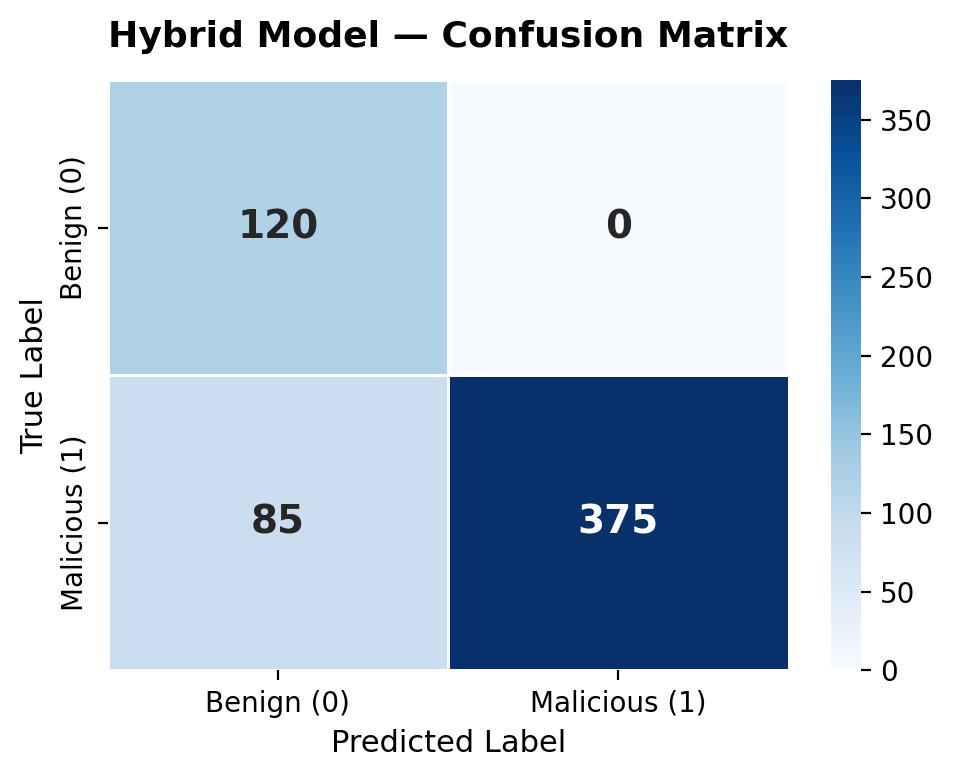

# Hybrid Intrusion Detection System for Containerised Environments

> A late-fusion IDS combining syscall and network telemetry to detect runtime threats inside Docker containers.


---

## TL;DR

A two-model pipeline that watches Docker containers at runtime, classifies behaviour from syscall traces and network flows independently, and fuses the two probability streams through a deterministic rule. Built and evaluated as the final-year artefact for a BSc Cybersecurity dissertation at Birmingham City University, awarded a First Class grade.

| Metric | Syscall-Only | Network-Only | **Hybrid** |
| --- | --- | --- | --- |
| F1 (synthetic, n=580) | 0.719 | 0.841 | **0.898** |
| Recall | 0.561 | 0.726 | **0.815** |
| FPR | 0.000 | 0.000 | **0.000** |
| Runtime accuracy (6 live containers) | — | — | **0.667** |

Peak synthetic F1 of **0.957** at a 15-second detection window. Runtime performance dropped under distribution shift, which is discussed honestly in the Limitations section below.

---

## Why this project exists

Container runtimes are short-lived, ephemeral, and share the host kernel. Traditional host-based IDS tools assume a long-lived OS and persistent disk artefacts. Network IDS misses everything that stays inside the container. Both views are partial. The research question was whether combining them through late fusion improves detection over either alone.

The deliverable is a working pipeline that captures both telemetry streams from live containers, classifies them, fuses the results, and produces evaluation metrics suitable for a research write-up.

---

## Architecture

```
┌──────────────────────────────────────────────────────────────────────┐
│                       Docker Container Workload                       │
└──────────────────────┬─────────────────────────┬─────────────────────┘
                       │                         │
              syscalls │                         │ network traffic
                       ▼                         ▼
            ┌──────────────────┐       ┌──────────────────┐
            │  sysdig (eBPF)   │       │     tshark       │
            └────────┬─────────┘       └────────┬─────────┘
                     │                          │
            sysdig_raw.txt                   *.pcap
                     │                          │
            ┌────────▼─────────┐       ┌────────▼─────────┐
            │ Feature extract  │       │ Feature extract  │
            │  + schema align  │       │  + schema align  │
            └────────┬─────────┘       └────────┬─────────┘
                     │                          │
            ┌────────▼─────────┐       ┌────────▼─────────┐
            │ Logistic Reg.    │       │ Random Forest    │
            │ (CHIDS-trained)  │       │ (Bot-IoT trained)│
            └────────┬─────────┘       └────────┬─────────┘
                     │       p_sys     p_net    │
                     └──────────┬───────────────┘
                                ▼
                  ┌─────────────────────────┐
                  │ Late-fusion decision    │
                  │ (deterministic rule)    │
                  └────────────┬────────────┘
                               ▼
                         Benign / Malicious
```

A Mermaid version of this diagram lives in [`docs/architecture.md`](docs/architecture.md).

---

## Results

### Synthetic evaluation (n = 580)

Confusion matrix for the hybrid model:

|  | Predicted Benign | Predicted Malicious |
| --- | --- | --- |
| **Actual Benign (120)** | 120 | 0 |
| **Actual Malicious (460)** | 85 | 375 |

Zero false positives is a property of the synthetic paired set rather than a real-world guarantee. The set is balanced and curated; production noise would change this. Treat the FPR figure as a controlled-conditions ceiling.




### N-window sensitivity

The detection window N is the number of seconds of telemetry aggregated before a verdict is issued. F1 peaks at N=15s and degrades on either side. Shorter windows lose signal; longer windows mix benign and malicious behaviour and dilute the decision.


### Runtime evaluation (6 Docker containers)

| Scenario | True label | Hybrid verdict | Notes |
| --- | --- | --- | --- |
| 1 | Benign workload (nginx) | Benign | clean |
| 2 | Benign workload (python REST API) | Benign | clean |
| 3 | Reverse shell | Malicious | syscall-led |
| 4 | Cryptominer | Malicious | network-led |
| 5 | Privilege escalation attempt | Benign (FN) | distribution shift |
| 6 | Data exfiltration | Benign (FN) | distribution shift |

Runtime accuracy was **4/6 = 66.7%**. The drop from synthetic to runtime is the most interesting finding in the project, not the headline F1 number. It demonstrates how brittle ML-based IDS becomes when training data does not match deployment conditions. See the dissertation for full analysis.

---

## How fusion works

The fusion layer is a deterministic rule rather than a learned meta-classifier. This was a deliberate choice for explainability — every verdict can be traced to two probabilities and a fixed rule, with no opaque second-stage model in between.

```python
def hybrid_decision(p_sys: float, p_net: float) -> str:
    if p_sys >= 0.60:                       # syscall model highly confident
        return "MALICIOUS"
    if p_net >= 0.50 and p_sys >= 0.10:    # network flags + syscall suspicion floor
        return "MALICIOUS"
    return "BENIGN"
```

The thresholds were tuned on a validation split with the goal of preserving zero false positives on benign samples while maximising recall. The syscall suspicion floor (0.10) exists because pure network signals proved noisy on benign workloads with bursty traffic; requiring a small amount of syscall corroboration removed those misfires.

---

## Repository structure

```
.
├── data/
│   ├── raw/                    # CHIDS + Bot-IoT source datasets
│   └── runtime/                # sysdig + tshark captures from live containers
├── models/
│   ├── syscall/                # Logistic Regression + scaler
│   └── network/                # Random Forest
├── src/
│   ├── common/config.py        # Single source of truth for paths
│   ├── syscall/                # training / inference / evaluation
│   ├── network/                # training / inference / evaluation
│   └── hybrid/                 # fusion / evaluation / runtime capture
├── tests/                      # End-to-end validation suite
├── demo/                       # Four prepared runtime scenarios (see below)
├── outputs/
│   ├── predictions/            # Per-model and hybrid prediction CSVs
│   ├── metrics/                # Evaluation tables
│   └── plots/                  # Confusion matrices, ROC curves, N-window plot
├── requirements.txt
└── README.md
```

---

## Quick start

```bash
# 1. Clone and install
git clone https://github.com/mus1afq/Hybrid-IDS-Containers.git
cd Hybrid-IDS-Containers
pip install -r requirements.txt

# 2. Reproduce the headline metrics on the bundled synthetic set
python3 src/hybrid/evaluation/evaluate_hybrid_synthetic.py

# 3. Full end-to-end validation
bash tests/run_all_tests.sh
```

For the live capture pipeline (requires `docker`, `sysdig`, `tshark`):

```bash
bash src/hybrid/runtime/run_and_capture.sh
python3 src/hybrid/runtime/extract_syscall_features.py
python3 src/hybrid/runtime/extract_network_features.py
python3 src/hybrid/runtime/align_network_schema.py
python3 src/syscall/inference/run_syscall_inference.py
python3 src/network/inference/run_network_inference.py
python3 src/hybrid/fusion/run_hybrid_fusion.py
python3 src/hybrid/evaluation/evaluate_hybrid_runtime.py
```

---

## Demo scenarios

The `demo/` directory contains four prepared scenarios used during the viva. Each one launches a Docker workload, runs capture, and produces a verdict.

| Scenario | Workload | Expected verdict |
| --- | --- | --- |
| `01_benign_webserver` | nginx serving static content | Benign |
| `02_reverse_shell` | bash reverse shell from a compromised container | Malicious |
| `03_cryptominer` | XMRig running against a public pool | Malicious |
| `04_exfiltration` | curl-based data exfiltration over HTTPS | Malicious |

Run any scenario with:

```bash
bash demo/<scenario>/run.sh
```

---

## Design decisions

A short record of the calls made during the build and the reasoning behind them.

- **Logistic Regression for syscalls, not a deep model.** The CHIDS feature vector is small (125 features) and the dataset is modest. A linear model trained in seconds, generalised well on the validation split, and produced interpretable coefficients suitable for the dissertation discussion.
- **Random Forest for network, not gradient boosting.** Bot-IoT has well-known class imbalance and noisy features. Random Forest tolerated both without much tuning. XGBoost was benchmarked and offered ~1% F1 improvement, not enough to justify the dependency.
- **Deterministic fusion, not a meta-classifier.** Stacking a third model on top of two probability streams adds opacity and risks overfitting the validation set. A two-line rule is auditable and behaves predictably under partial input.
- **sysdig over Falco.** Falco is a higher-level abstraction on top of similar kernel hooks. sysdig gave direct event traces, which were easier to align with the CHIDS schema.
- **Late fusion, not early fusion.** Concatenating raw features from two domains would have required a unified schema and a single model. Late fusion lets each modality use its own representation and classifier.

---

## What I would improve

Written before viva. The grader picked up most of these.

- **Larger and noisier evaluation set.** n=580 is small; the perfect precision figure reflects that. A 5–10k sample set with realistic class imbalance would stress the fusion rule properly.
- **End-to-end hybrid evaluation on the same raw samples.** The current synthetic hybrid metric uses pre-paired probability CSVs rather than running both pipelines against the same input traces. Re-evaluating against paired raw captures would strengthen the claim.
- **Threshold learning instead of manual tuning.** Grid search over the three thresholds, optimising on a held-out set, would be more defensible than the empirical choice.
- **Concept drift handling.** The runtime accuracy drop is a distribution shift problem. A streaming retraining loop or a calibration step would be the next research direction.
- **More attack diversity at runtime.** Six scenarios is a demo, not an evaluation.

---

## Project timeline

The repository has a single commit because the dissertation submission process required a clean upload. The work itself ran across the full final year. Phases below.

| Phase | Period | Milestones |
| --- | --- | --- |
| Scoping | Sep–Oct 2025 | Problem definition, supervisor sign-off, dataset selection (CHIDS, Bot-IoT) |
| Data pipeline | Oct–Nov 2025 | Preprocessing, schema alignment scripts, feature extraction modules |
| Modelling | Nov 2025–Jan 2026 | Syscall LR classifier, network RF classifier, single-modality baselines |
| Fusion | Feb 2026 | Late-fusion rule design, threshold tuning, synthetic evaluation |
| Runtime capture | Feb–Mar 2026 | sysdig + tshark Docker pipeline, demo scenario builds |
| Evaluation | Mar–Apr 2026 | N-window analysis, runtime experiments, distribution-shift investigation |
| Write-up | Apr–May 2026 | Dissertation drafting, results consolidation, plot generation |
| Submission and viva | May–Jun 2026 | Final submission, viva preparation, repository finalisation |

A more granular CHANGELOG covering individual scripts and decisions lives in [`CHANGELOG.md`](CHANGELOG.md).

---

## Tech stack

| Layer | Tools |
| --- | --- |
| Runtime capture | Docker, sysdig (eBPF), tshark |
| Feature engineering | Python, pandas, NumPy |
| Modelling | scikit-learn (Logistic Regression, Random Forest), joblib |
| Evaluation | matplotlib, seaborn |
| Datasets | CHIDS (syscalls), Bot-IoT (network flows) |
| Orchestration | bash, GitHub Actions (CI) |

---

## Limitations

Listed plainly because the project should not be read as production-ready.

- The synthetic FPR of 0.000 is a property of the evaluation set, not a generalisable claim.
- Runtime evaluation covered six scenarios. Two missed detections under distribution shift dropped accuracy to 66.7%.
- Both training datasets are static, dated, and do not reflect modern attacker behaviour against containerised microservices.
- The fusion thresholds were tuned by hand on a single validation split.
- The system is offline and batch-oriented. Latency was not optimised.

---

## References

- CHIDS Dataset — Container Host Intrusion Detection System dataset, used for syscall model training.
- Bot-IoT Dataset — Koroniotis et al., 2019, used for network model training.
- sysdig — runtime syscall capture (https://github.com/draios/sysdig).
- tshark — packet capture and analysis (https://www.wireshark.org/).

Full reference list in the dissertation appendix.

---

## Author

**Mustafa Sheikh** (`mshk`) — BSc (Hons) Cybersecurity, First Class, Birmingham City University, 2026.

- Portfolio: [mustafaashk.com](https://mustafaashk.com)
- Email: [Mustafaashk@yahoo.com](mailto:Mustafaashk@yahoo.com)
- GitHub: [@mus1afq](https://github.com/mus1afq)
- LinkedIn: [Mustafa Sheikh](https://uk.linkedin.com/in/mustafa-sheikh-357715341)

Open to graduate roles in penetration testing, SOC analysis, cloud security, application security, and product engineering. Get in touch.

---

## License

MIT — see [`LICENSE`](LICENSE).
